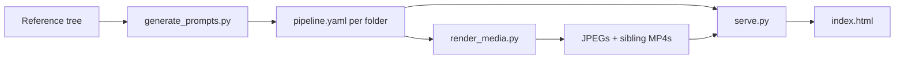

# reimagine

Recreate reference images as dynamic-posture stills and LTX 2.3 videos. The
pipeline is deliberately split into two processes so an LLM server and ComfyUI
never need to fit in VRAM at the same time:

```text
reference images -> generate_prompts.py -> per-folder pipeline.yaml files
pipeline tree    -> render_media.py     -> JPEGs + MP4s
```

`serve.py` provides a gallery for comparing the generated media with its
references.

## Architecture / Design / UI Goals

The planner (`generate_prompts.py`) never talks to ComfyUI. The renderer
(`render_media.py`) never talks to an LLM. Each image folder’s `pipeline.yaml`
is the versioned handoff: prompts, paths, dimensions, duration. The gallery
server reads those manifests once at startup into a disposable JSON index,
walks media live per request, and serves `index.html` as a virtualized
Safari-first comparison UI.

Lightbox chrome stays compact. Landscape pairs stack; portrait (and
short-wide phone landscape) go side-by-side with portrait images meeting at
center. A reading-style HUD hides every control so the media can use the
viewport; hidden HUD state survives navigation and resets when the lightbox
is reopened. Video playback is kept; HTTP range/chunked video serving is not
implemented.



Operational flags, prompt stages, and gallery cache layout stay in the sections
below. Topic docs are for later sessions that should open only what they need:

| Doc | When to read |
| --- | --- |
| [docs/README.md](docs/README.md) | Topic-file index with the same when-to-read rules |
| [docs/architecture.md](docs/architecture.md) | Pipeline vs gallery data flow, HTTP routes, key modules |
| [docs/ui.md](docs/ui.md) | Lightbox/gallery interaction, orientation, HUD, Safari/touch |
| [docs/performance.md](docs/performance.md) | Manifest index, thumbnail cache, virtualization, measurements |
| [docs/testing.md](docs/testing.md) | unittest vs Playwright, 4k fixture, how to run tests |
| [REGION_PROMPT_EXPERIMENTS.md](REGION_PROMPT_EXPERIMENTS.md) | Historical region-prompt LLM benchmarks, not runtime architecture |

## Setup

```bash
uv venv --python 3.14 .venv
uv pip install --python .venv -r requirements.txt
```

ComfyUI defaults to `127.0.0.1:8188`. `--comfyui-output-dir` is optional; when
provided, artifacts are read directly from a local or mounted ComfyUI `output/`
directory. HTTP `/view` is the fallback.

## Two-phase workflow

Generate both still and video prompts while only the LLM is loaded:

```bash
.venv/bin/python generate_prompts.py \
  --stage all \
  --still-mode regions \
  --video-basis reference \
  --llm-server 127.0.0.1:9503 \
  --output-dir outputs/local-regions
```

Stop the LLM server, start ComfyUI, then render all stills followed by all
videos:

```bash
.venv/bin/python render_media.py \
  --stage all \
  --output-dir outputs/local-regions \
  --comfyui-output-dir ~/Desktop/MyShare
```

The renderer uploads each final local JPEG to ComfyUI's input directory before
starting LTX. The exact image shown in the gallery is therefore the video's first
frame; video rendering does not depend on stale ComfyUI output staging.

## Prompt stages

`generate_prompts.py` runs serially and checkpoints a `pipeline.yaml` in each
image folder. It never imports or contacts ComfyUI. Startup and resume scan the
whole output tree, so no top-level manifest grows with the total collection.
Each manifest stores its input directory as a path relative to this `reimagine/`
folder. The default is `input`; directories linked from within the input tree may
be symbolic links.

| flag | default | meaning |
| --- | --- | --- |
| `--stage` | `all` | generate `stills`, `videos`, or `all` plans |
| `--still-mode` | `manual` | plain `manual` prompt or structured `regions` spec |
| `--video-basis` | `reference` | generate motion from the `reference` or actual `rendered` still |
| `--common-dims` | off | center-crop temporary reference copies to the closest common 1.5 MP size |
| `--output-dir` | `output` | output set and default manifest location |
| `--manifest` | per-folder tree | use one explicit legacy/single-file manifest instead |
| `--duration` | `10` | video duration in seconds, 1-30 |
| `--prompt-path-prefix` | `prompts/` | directory containing the system prompt files |
| `--llm-server` | *(none)* | OpenAI-compatible multimodal server; otherwise Claude Code |
| `--llm-max-tokens` | `16384` | maximum completion-token budget for the OpenAI-compatible server |
| `--llm-reasoning` | `on` | llama.cpp reasoning mode; use `off` to disable |
| `-v`, `--verbose` | off | log rejected LLM responses; repeat (`-vv`) to include available reasoning |
| `--force` | off | regenerate requested plan stages |

The default `reference` video mode uses the original reference plus the
validated still plan. Its dedicated system prompt deliberately requests
conservative motion that does not depend on exact generated limb geometry.
Video prompt detail scales with `--duration`: the planner targets roughly
8-16 words per second (80-160 words for 10 seconds and 160-320 words for 20
seconds), up to a 500-word maximum. Longer prompts use related temporal beats,
evolving synchronized audio, and an explicit final state rather than adding
unrelated action or re-describing the first frame.

`--prompt-path-prefix` must contain `system_manual.txt`, `system_regions.txt`,
`regions.schema.json`, `system_video.txt`, and `system_video_reference.txt`.
Relative paths are resolved from the directory where `generate_prompts.py` is
run.

To use a different input tree for an output set, seed that set with an
input-only `pipeline.yaml` before its first prompt run:

```bash
mkdir -p outputs/sports-omlx-16k
printf 'input_dir: input/sports\n' > outputs/sports-omlx-16k/pipeline.yaml
.venv/bin/python generate_prompts.py \
  --output-dir outputs/sports-omlx-16k \
  --llm-server 127.0.0.1:9503
```

The generated manifests retain `input_dir: input/sports`. Subsequent prompt runs
and the gallery read it from those manifests; no input-directory command-line
option is needed.

`--common-dims` EXIF-normalizes each reference, scales it with Lanczos
resampling, and center-crops it to the closest supported aspect ratio. The
temporary JPEG copies are used for still prompting and for reference-basis
video prompting; source files are never modified. The selected dimensions are
also saved as the still render dimensions:

| Format | Dimensions |
| --- | ---: |
| Base portrait (2:3) | 1024 x 1536 |
| Stable portrait (3:4) | 1088 x 1440 |
| Tall mobile (9:16) | 928 x 1664 |
| Base landscape (3:2) | 1536 x 1024 |
| Balanced landscape (4:3) | 1440 x 1088 |
| Widescreen (16:9) | 1664 x 928 |
| Square format (1:1) | 1248 x 1248 |

When splitting still and reference-basis video planning into separate commands,
pass `--common-dims` to both so each temporary copy uses the same deterministic
crop. The manifest records this preprocessing mode and rejects a mismatched
resume rather than silently planning against different framing. Omitting the
flag preserves the existing aspect-ratio-derived dimensions and original
reference image behavior.

Invalid tagged or region responses consume one of three prompt attempts. Retry
logs include the rejection reason and elapsed time; region JSON that parses but
fails semantic validation is retried instead of failing the item immediately.
Formatting and validation retries send the error and rejected response back to
the LLM so it can correct its prior output. For OpenAI-compatible servers, the
region schema is sent per request using the standard
`response_format.json_schema` field supported by llama.cpp and vLLM; the server
does not need to be started with a schema. Region responses are constrained to
compact, output-only JSON to avoid exhausting the completion budget on narrated
analysis.
The local
`-v` option logs the complete rejected response for diagnosing parse failures;
`-vv` also logs separate reasoning content when the backend provides it. The local
OpenAI-compatible client enables llama.cpp prompt caching and places retry-only
instructions after the image so llama.cpp can reuse the unchanged multimodal
prefix. Requests still transfer and decode the image, but a cache hit avoids
repeating the expensive vision-token evaluation. Cache usage and server timing
metadata are logged at `DEBUG` when returned by the server. A transient HTTP 500
from the completion endpoint is retried once after one second.
`--llm-reasoning` sets llama.cpp's per-request `reasoning` option; changing it
does not require restarting the server or modifying the system prompt. The 16k
budget with reasoning enabled is the default because it was the fastest and most
reliable configuration in the 20-image schema benchmark.

## Exact-frame prompting

For higher fidelity, use an additional LLM phase that inspects the actual still:

```bash
# 1. LLM: still plans
.venv/bin/python generate_prompts.py --stage stills --still-mode regions \
  --output-dir outputs/exact

# 2. ComfyUI: still renders
.venv/bin/python render_media.py --stage stills --output-dir outputs/exact

# 3. LLM: video prompts grounded in those exact JPEGs
.venv/bin/python generate_prompts.py --stage videos --still-mode regions \
  --video-basis rendered --output-dir outputs/exact

# 4. ComfyUI: videos
.venv/bin/python render_media.py --stage videos --output-dir outputs/exact
```

Rendered-basis video plans record the JPEG SHA-256. Rerendering a still requires
regenerating its rendered-basis video prompt before the video phase.

## Render stages

`render_media.py` never imports or constructs an LLM. It can run without the
reference tree because the per-folder `pipeline.yaml` files contain every
required prompt, path, dimension, and duration. Seeds are a renderer concern
and are not stored in prompt manifests.

| flag | default | meaning |
| --- | --- | --- |
| `--stage` | `all` | render `stills`, `videos`, or all stills then all videos |
| `--output-dir` | `output` | media output set |
| `--manifest` | per-folder tree | use one explicit legacy/single-file manifest instead |
| `--state-file` | per-folder tree | use one explicit legacy/single-file render state instead |
| `--comfy-server` | `127.0.0.1:8188` | ComfyUI server |
| `--comfyui-output-dir` | *(none)* | optional local/mounted ComfyUI output directory |
| `--still-workflow` | mode default | custom Krea API workflow |
| `--video-workflow` | checked-in LTX workflow | custom LTX API workflow |
| `--clip-name` | workflow value | optional still-workflow CLIP override |
| `--unet-name` | workflow value | optional still-workflow UNet override |
| `--video-clip-name` | workflow value | optional LTX text-encoder override |
| `--video-unet-name` | workflow value | optional LTX diffusion-model override |
| `--seed` | `42` | base render seed; item i uses seed plus its sorted index |
| `--force` | off | rerender requested stages |

Each image folder's `render_state.yaml` tracks its render fingerprints and
output hashes. A changed still invalidates its dependent video. Corrupt or
stale files are not silently accepted merely because a path exists.

Planner and renderer progress uses Python logging. Normal runs emit per-item
prompt or render durations and a total elapsed-time summary at `INFO`; retries,
blocked work, and unavailable services use `WARNING`; failures use `ERROR`.
All command help includes argument defaults.

## Manifests and gallery metadata

The per-folder `pipeline.yaml` files are the authoritative, versioned handoff
between the two processes. Each item stores:

- Stable source-relative ID, source path, and source SHA-256
- Exact manual prompt or complete validated region spec
- Still output path and dimensions
- Video output path, prompt, duration, prompt basis, and basis hash

Each folder therefore contains `pipeline.yaml` and `render_state.yaml` beside
its media. The gallery reads prompts and the configured reference directory
directly from `pipeline.yaml`. Existing top-level manifests and render-state
files are migrated into the folder layout on the next default planner or
renderer run; explicit `--manifest` and `--state-file` paths retain single-file
behavior.

## Batch scripts

```bash
scripts/generate_plans.sh  # LLM-only pass
scripts/render_plans.sh    # ComfyUI-only pass
```

Both scripts accept environment overrides documented in their source.

To collect images whose initial LLM response needed a retry for a focused
diagnostic rerun:

```bash
.venv/bin/python analyze_prompt_failures.py outputs/*.log \
  --source-dir /path/to/references
```

This copies the matching references to `input/first-attempt-failures/` by
default. Rerun that directory with `-v` or `-vv` to inspect rejected responses.

## Gallery

Interaction model and HUD goals: [docs/ui.md](docs/ui.md). Cache layout and
startup measurements: [docs/performance.md](docs/performance.md). Tests:
[docs/testing.md](docs/testing.md).

```bash
.venv/bin/python serve.py              # http://127.0.0.1:8000
.venv/bin/python serve.py --port 9000
```

Output sets live under `outputs/`. The gallery discovers each set directory,
uses each set's `pipeline.yaml` to find its references, shows those references
beside generated stills, and switches to sibling videos when available. In the
lightbox, tap the outer quarter of either side, swipe, or use Left/Right Arrow
to navigate. Tap the middle half or press `H` to hide/show all lightbox chrome
and give the media more room; a center tap closes an open prompt before hiding
the HUD. Closing and reopening the lightbox restores visible controls.
Pipeline metadata is loaded before the server starts listening and remains
fixed for the lifetime of the process; restart the gallery after changing a
manifest. A disposable
`.reimagine-cache/manifest-index-v1-<scope-hash>.json` index keeps the validated
result of each YAML manifest. The scope hash is a stable SHA-256 prefix derived
from the sorted canonical discovery roots and relevant discovery options; it
contains no root names or paths. A normal invocation creates one obvious index,
while servers using the same cache root for different discovery scopes keep
separate indexes and cannot discard each other's warm entries. On restart,
unchanged manifests are recognized by canonical path, size, and high-resolution
file identity fields and do not need to be parsed again. New and changed
manifests are parsed, deleted manifests are dropped from that scope's index, and
missing, incompatible, or corrupt indexes are rebuilt from the authoritative
YAML files. Cached input-directory values are revalidated with the same
authoritative path rules as YAML before reuse. A source with malformed or
inconsistent manifests is logged and remains browseable without reference or
prompt metadata. Media files are still discovered live on each request.
Project manifests use project-relative index keys. If an explicitly served
output root is outside the project, its canonical absolute manifest key may
appear only in this server-local JSON; index contents are never returned by the
HTTP API.

Still rendering writes 512 px maximum-edge WebP thumbnails under the same
project-level disposable cache, preserving aspect ratio and EXIF orientation
without upscaling. The gallery uses the cache for lazy fallback; input and
output media trees remain read-only. `render_media.py` and `serve.py` both
accept `--cache-root` to relocate the complete cache. The older
`--thumbnail-cache-root` spelling remains a deprecated alias and now also names
the unified cache root, so thumbnails for either spelling are written beneath
the selected root's `thumbnails/` subdirectory.

The thumbnail layout is
`.reimagine-cache/thumbnails/{input|output}/<media-root-name>-<root-hash>/<relative-path>.<source-fingerprint>.webp`.
The root hash namespaces different pipeline and reference roots without placing
absolute paths in URLs or cache paths. Complete source filenames and immutable
source fingerprints prevent extension, root, and version collisions. Thumbnail
writes are atomic; corrupt entries are regenerated. A lightweight fingerprint
of the relative path and high-resolution file identity fields drives both disk
paths and versioned URLs without hashing every full image during gallery
listing. Versioned and legacy files are retained because another process or
active request may still need them; perform cleanup offline while renderers and
gallery servers are stopped. Versioned responses use long-lived immutable
browser caching, while the lightbox loads full-resolution media.

Manifest indexes and thumbnails can be deleted while the renderer and gallery
are stopped; the next render or server startup recreates what it needs.
Deleting a scope's index forces a full YAML rebuild for that scope. Existing `.thumbnails/` data is
not migrated and can be removed because it contains only generated artifacts.
If cache permissions or stale local state cause startup warnings, stop all
gallery/renderer processes, remove `.reimagine-cache/`, and restart.

Gallery records are streamed as they are discovered, without embedding prompt
text. Prompt metadata is requested from `/api/metadata` only when a lightbox
item opens and is served from the startup manifest cache. The page uses a
windowed grid with a small overscan buffer, keeping card and media-node counts
bounded as the collection grows while retaining navigation across the full
logical result set. In-view thumbnails are requested before overscan so a jump
down the page is not queued behind off-screen rows.
