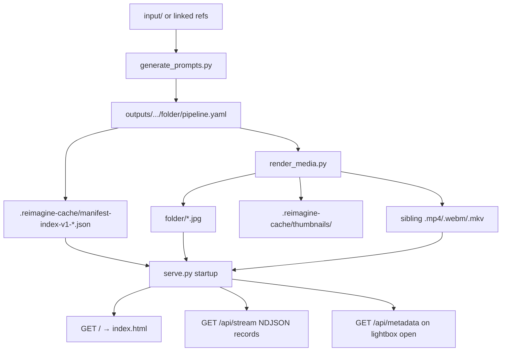

# Architecture

Two processes share one versioned artifact. `generate_prompts.py` writes
per-folder `pipeline.yaml` and never imports ComfyUI. `render_media.py` reads
those files, writes JPEGs and sibling videos, and never constructs an LLM.
`serve.py` is a stdlib HTTP gallery; `index.html` is the only frontend.

YAML remains source of truth. Seeds live in the renderer, not the manifest.

## Data flow

1. Planner scans the output tree, checkpoints `pipeline.yaml` in each image
   folder, and stores `input_dir` relative to `reimagine/`. Default input is
   `input`. Linked directories inside the input tree may be symlinks.
2. Renderer consumes the tree (or a legacy `--manifest` file), writes stills
   then videos, and tracks fingerprints in per-folder `render_state.yaml`.
   After each still it writes a 512 px WebP thumbnail into the project cache.
3. `serve.py` discovers output sets under `outputs/` (or `--output-dir`),
   builds an in-memory metadata cache from the persisted JSON index before
   `serve_forever()`, then serves media live on each list/stream request.
4. The page streams gallery records without prompts. Opening a lightbox item
   fetches `/api/metadata?source=&path=`. Full-resolution stills and videos
   load in the lightbox; the grid uses versioned thumbnail URLs.

Malformed or inconsistent manifests are logged. That source stays browseable
without reference or prompt metadata (`input_dir` is `None`, prompt map
empty). Media discovery does not depend on a valid manifest.

## Gallery routes

| Route | Role |
| --- | --- |
| `/`, `/index.html` | Static gallery page |
| `/api/sources` | Source names + default |
| `/api/list`, `/api/stream` | Records; stream is NDJSON |
| `/api/metadata` | Prompt + video_prompt from startup cache |
| `/img/output/<source>/…` | Output stills and videos (`read_bytes`, no Range) |
| `/img/input/<source>/…` | References allowlisted during the last list/stream |
| `/img/thumbnail/{input\|output}/…` | Immutable WebP when `?v=` fingerprint matches |

Pipeline metadata is fixed for the process lifetime; restart after changing a
manifest. Index contents are never returned over HTTP.

Video support is kept: sibling videos are listed, and the UI can play them.
Range/chunked video serving is not implemented.

## Key modules

| Module | Role |
| --- | --- |
| `generate_prompts.py` | LLM-only planner CLI |
| `render_media.py` | ComfyUI-only renderer CLI; `--cache-root` |
| `serve.py` | Gallery HTTP server, index, live media walk |
| `index.html` | Virtualized gallery + lightbox |
| `reimagine_pipeline/manifest.py` | Load/save/validate `pipeline.yaml` |
| `reimagine_pipeline/files.py` | Paths, atomic writes, thumbnails, common dims |
| `reimagine_pipeline/rendering.py` | Still/video render + thumbnail backfill |
| `reimagine_pipeline/models.py` | `PipelineItem` / still / video specs |
| `reimagine_pipeline/llm.py` | Claude Code and OpenAI-compatible clients |
| `reimagine_pipeline/prompting.py` | Still/video prompt generation |
| `reimagine_pipeline/comfy.py` | ComfyUI HTTP + artifact fetch |
| `reimagine_pipeline/workflows.py` | Workflow JSON patches |
