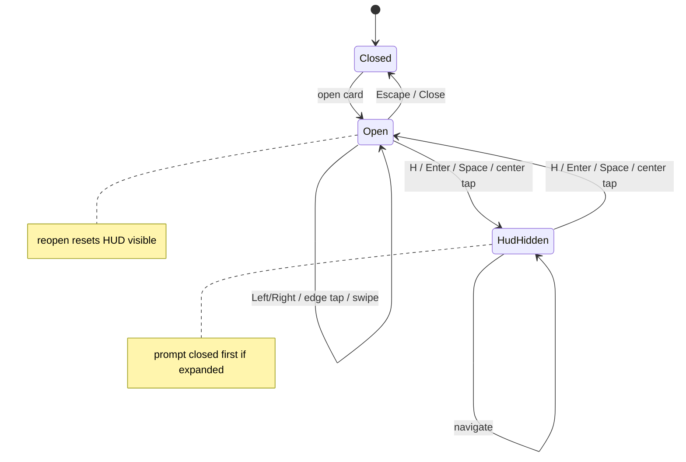

# UI

Primary user testing is Safari on Mac, iPad, and iPhone. Playwright WebKit
approximates Safari; it is not a substitute for a real device pass. The page
is a single `index.html` with compact chrome, Apple-system fonts, and
safe-area padding in the lightbox.

## Gallery

The grid is windowed. Cards that are in the scroll window (plus six rows of
overscan) exist in the DOM; the rest of the logical set stays in memory for
filter and lightbox navigation. Nodes are keyed
(`item:<source>:<path>`, `heading:<category>`) and reused across scrolls.
Thumbnails in the window load `eager`. Source selection persists in
`localStorage`. On coarse pointers the gallery scrollbar stays visually
compact but uses a 44px hit strip.

## Comparison layout

Lightbox compare uses the **result** orientation when source and result
disagree.

| Case | Layout |
| --- | --- |
| Landscape pair | Stacked (two rows) |
| Portrait pair | Side-by-side columns |
| Phone landscape, short-wide | Columns even for landscape media when the stage is short, wide, and columns fit more pixels |

Portrait image pairs set `object-position` so the two stills meet at
center (reference right-aligned, primary left-aligned). Hiding the HUD
must reclaim chrome height and must not shrink the media.

## Reading-style HUD

All chrome hides together: filename, Close, compare toggle, figure labels,
hint, prompt toggle, prompt panel. Hidden nodes are `hidden` and `inert`.
Background header/main are inert while the lightbox is open.

| Input | Behavior |
| --- | --- |
| Middle 50% tap | Toggle HUD (after prompt-first-close) |
| Outer 25% tap | Previous / next item; exact 25% pixel is center |
| H, Enter, Space | Toggle HUD (Enter/Space only when the stage is focused) |
| Escape | Close lightbox |
| Pointer move > 14 px | Not a tap; no HUD toggle or edge nav |
| Video / chrome | Not HUD hit targets; video controls stay usable when HUD is hidden |

Tap bands are relative to the **visible** viewport, including while pinch-zoomed. iOS Safari reports tap `clientX`/`clientY` in that visual space already, so a right-edge tap must not be shifted by `visualViewport.offsetLeft` after a pan.

A center tap (or HUD toggle) **closes an open prompt first** and leaves the HUD
visible. A second center tap hides the HUD.

Hidden HUD state is preserved across item navigation. Closing and reopening
the lightbox resets the HUD to visible. Navigation keeps the current stills
painted until the next media can decode, so a cache miss does not flash the
empty stage.

Video mode still compares against the reference still. Range/chunked video
delivery is a server gap, not a UI feature.
